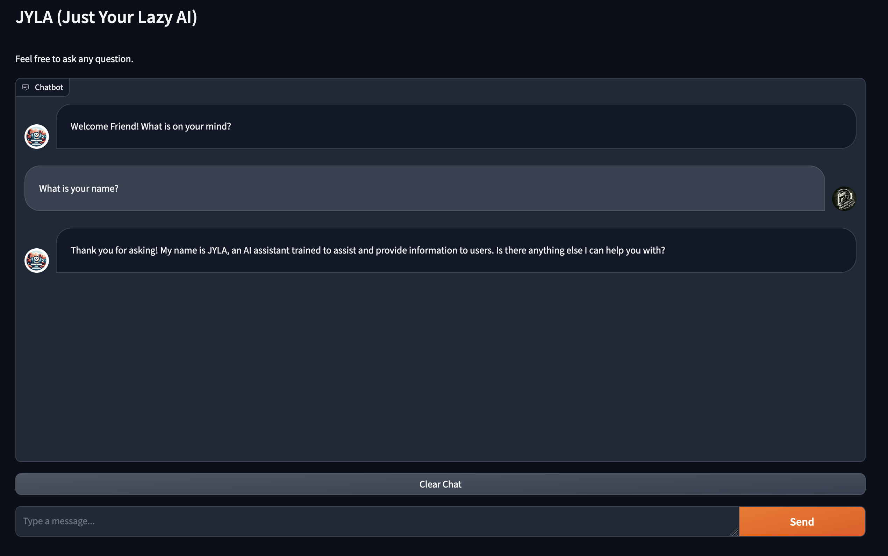

# JYLA

JYLA (Just Your Lazy AI) is a cutting-edge open-source RAG (Retrieval-Augmented Generation) chatbot designed to empower users with the advanced capabilities of Large Language Models (LLMs) while addressing concerns about data privacy and accessibility. Unlike traditional chatbots, JYLA leverages the power of open-source technology to keep user data local, eliminating the need to share sensitive or proprietary information with third-party organizations.



### Purpose and Benefits:

JYLA aims to democratize access to sophisticated LLMs, enabling individuals, open-source communities, and small businesses to harness the power of natural language processing without the financial constraints of proprietary models. By providing a user-friendly interface and seamless integration with popular libraries like Ollama and Gradio, JYLA simplifies the process of interacting with LLMs, making it accessible to users of all skill levels.

### How JYLA Differs:

- **Data Privacy**: Unlike proprietary chatbots that may store user data on external servers, JYLA prioritizes data privacy by keeping all interactions local to the user's machine. This ensures that sensitive information remains secure and under the user's control at all times.

- **Cost-Effectiveness**: Traditional chatbots often come with hefty subscription fees or licensing costs, making them inaccessible to individuals and small businesses. JYLA, being open-source, eliminates these barriers by providing free access to powerful LLM capabilities.

- **Customizability**: JYLA allows users to tailor their chatbot experience by easily modifying underlying models and configurations. Whether it's selecting different LLM architectures or fine-tuning response generation parameters, JYLA offers flexibility and customization options to suit diverse user needs.

### Dependenies

* [Python3](https://www.python.org/downloads/)
* [Ollama](https://ollama.com/)
* [Llamaindex](https://www.llamaindex.ai/)
* [Gradio](https://www.gradio.app/)

### Installation

1. Install Ollama and ensure it is running on your local machine at http://localhost:11434.  The two default models that JYLA uses are [Llama2](https://ollama.com/library/llama2) (as the LLM) and [Nomic-Embed-Text](https://ollama.com/library/nomic-embed-text) (for embeddings). Feel free to modify these as needed.  To download these models through ollama, run the following commands on the command line:

```
$ ollama pull llama2
$ ollama pull nomic-embed-text
```

2. Install the necessary python3 packages using the requirements.txt file:

```
$ pip install -r requirements.txt
```

### Running

Once the dependenies have been installed, start the application by running the following command on the command line from the JYLA folder:

```
$ python3 jyla.py
```

Once started, you can access the Chatbot application at http://127.0.0.1:7860